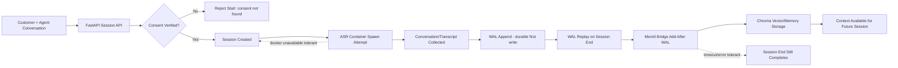
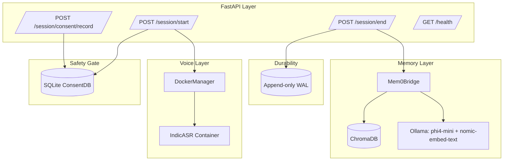

# PS-01: The Loan Officer Who Never Forgets

Roadmap-aligned implementation of a consent-gated, WAL-first memory engine for loan workflows.

This README focuses on the real runtime flow and wiring used in this project.

## What PS-01 Does

PS-01 demonstrates a banking conversation memory pipeline where:

1. Consent is recorded and verified before session start.
2. Session artifacts are persisted WAL-first for durability.
3. WAL facts are synced to memory backends.
4. Next sessions can reuse prior customer context.
5. Session close remains resilient even when memory backend is temporarily unavailable.

## End-to-End Workflow



## Runtime Wiring (What Talks to What)



## Session Lifecycle (Actual Behavior)

### 1) Record Consent

`POST /session/consent/record`

- Writes consent record in SQLite ConsentDB.
- Consent scope is checked later during session start.

### 2) Start Session

`POST /session/start`

- Requires `consent_id`.
- Validates consent against requested session type.
- Creates a new `session_id` when valid.
- Tries to spawn ASR container, but start stays available even if Docker/ASR is unavailable.

### 3) End Session

`POST /session/end`

- Replays facts from WAL for the session.
- If transcript is provided, appends it WAL-first before any memory sync.
- Attempts Mem0 sync with timeout guards.
- Session close remains successful even if memory sync fails temporarily.
- Attempts ASR container stop; cleanup failures do not block response.

## Guarantees and Resilience

- WAL-first durability: no memory write is trusted without WAL append first.
- Consent gate: session start is blocked when consent is missing/invalid.
- Graceful degradation:
	- Mem0/backend unavailability does not hard-fail session close.
	- ASR container issues do not block session start/end response paths.
- Timeout guards protect API responsiveness on slow memory operations.

## Project Layout (Memory-Relevant)

- `src/api`: REST endpoints and dependency wiring.
- `src/api/session.py`: consent/start/end orchestration.
- `src/api/middleware.py`: consent storage/verification.
- `src/core/wal.py`: append/replay durability layer.
- `src/core/mem0_bridge.py`: WAL-to-memory synchronization.
- `src/core/phi4_compactor.py`: compaction pipeline implementation.
- `src/infra`: infra adapters (Docker manager, Mem0 bootstrap).
- `src/preprocessing`: tokenization and derived banking rules.

## Quick Start

```bash
cd /home/parth/ccode/wam0/PS01
python3 -m venv .venv
source .venv/bin/activate
pip install -r requirements.txt
cp .env.example .env
```

### Ensure Ollama Models Exist

```bash
ollama list
ollama pull phi4-mini
ollama pull nomic-embed-text
```

### Run API

```bash
cd /home/parth/ccode/wam0/PS01
export PYTHONPATH=.
export OLLAMA_API=http://localhost:11434
export OLLAMA_HOST=http://localhost:11434
export OLLAMA_LLM_MODEL=phi4-mini
export OLLAMA_EMBED_MODEL=nomic-embed-text
uvicorn src.api.app:app --host 0.0.0.0 --port 8000
```

### Smoke Verify

```bash
curl http://localhost:8000/health

# 1) record consent
curl -X POST "http://localhost:8000/session/consent/record?session_id=cons_001&customer_id=cust_001&scope=home_loan_processing&signature_method=verbal"

# 2) start session
curl -X POST http://localhost:8000/session/start \
	-H "Content-Type: application/json" \
	-d '{
		"customer_id": "cust_001",
		"session_type": "home_loan_processing",
		"agent_id": "Agent_Priya",
		"consent_id": "cons_001"
	}'

# 3) end session (replace session_id from previous response)
curl -X POST http://localhost:8000/session/end \
	-H "Content-Type: application/json" \
	-d '{
		"session_id": "sess_replace_me",
		"transcript": "Customer income 55000, co-applicant Sunita, EMI 12000"
	}'
```

## API Endpoints

- `GET /health`
- `POST /session/consent/record`
- `POST /session/start`
- `POST /session/end`

## Docker Compose (Phase 8)

Compose uses host-local Ollama via `host.docker.internal:11434`.

```bash
cd /home/parth/ccode/wam0/PS01/docker
docker compose up -d --build
curl http://localhost:8000/health
docker compose logs -f ps01-app
docker compose down
```

## Testing

```bash
cd /home/parth/ccode/wam0/PS01
pytest -q
```

## References

- Root roadmap: `../IMPLEMENTATION_ROADMAP.md`
- System architecture source: `../system_artitectuere.md`
- PS01 architecture summary: `docs/ARCHITECTURE.md`
